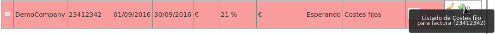

.. _invoices:

######################
Generación de facturas
######################

El objetivo final de todo el proceso de facturación es generar facturas que 
incluyan las llamadas con coste de una empresa concreta.

**********************
Plantillas de facturas
**********************

Antes de generar una factura de ejemplo, es importante entender que las 
facturas generadas utilizan unas plantillas que permiten su modificación.

.. hint:: De este modo, cada *operador de marca* puede crear plantillas con los 
   datos deseados, la estética deseada, añadir logos y hasta gráficas de 
   consumo.

Todo ello se realiza utilizando la librería `PHPPdf 
<https://github.com/psliwa/PHPPdf>`_.

La ayuda contextual de la sección **Configuración de Marca** > **Plantillas de 
facturas** incluye una explicación resumida del proceso de creación de 
plantillas. En la `página oficial de PHPPdf 
<https://github.com/psliwa/PHPPdf>`_ se puede encontrar más información.

Por defecto, IvozProvider incluye las siguientes plantillas de ejemplo (en la 
ayuda contextual se pueden encontrar enlaces a las mismas):

.. image:: img/invoices_templates.png

************
Costes fijos
************

Los costes fijos son un concepto fijo que se pueden añadir a las facturas que 
utilicen plantillas que tengan en cuenta costes fijos.

Sirva la siguiente imagen de ejemplo (sección **Costes Fijos**):

.. image:: img/fixed_costs.png

A la hora de generar una factura, como se verá más adelante, se podrá indicar 
cuáles de estos conceptos se incluyen en la factura (y en qué cantidades).

***********************
Creacion de una factura
***********************

La sección **Facturas** es la que permite al **operador de marca** generar 
facturas para emitir a sus empresas.

Añadimos una factura nueva para explicar el proceso:

.. image:: img/invoice_add.png
    :align: center

.. glossary::

    Número
        Será incluído en la factura y representa el número de factura

    Empresa
        Empresa para la cual estamos generando la factura

    Fecha inicio/fin
        Tramo temporal cuyas llamadas queremos tener en cuenta

    Impuesto
        Impuesto a añadir al coste total calculado

    Plantilla
        Plantilla que queremos utilizar para generar esta factura

Añadamos ahora unos costes fijos a esta factura concreta pulsando:

Y añadamos los costes fijos que queramos, así como sus cantidades:

.. image:: img/invoice_add3.png
    :align: center

En este punto, podemos generar la factura pulsando:

Pulsando el siguiente botón podemos ver las llamadas que han sido incluidas en 
la factura:

.. image:: img/invoice_add5.png
    :align: center

Y pulsando este botón podemos descargar la factura en formato PDF:

.. image:: img/invoice_add6.png
    :align: center

.. warning:: La fecha fin tiene que ser una fecha ya pasada. Es decir, no se 
   puede sacar facturas de tramos futuros o del día actual.

.. error:: Todas las llamadas del tramo escogido tienen que estar facturadas 
   para poder emitir la factura.

