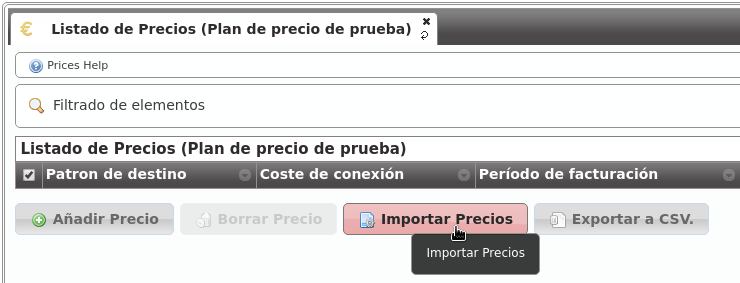
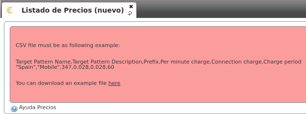

################
Planes de precio
################

En la sección :ref:`noplan_nocall` se hacía una introducción bastante completa sobre el proceso manual de creación de un plan de precios y los conceptos más importantes:

- **Un plan de precios agrupa un listado de patrones de precio (prefijos de llamada) con sus detalles de precio**:

    - Precio por minuto
    - Establecimiento de llamada
    - Facturación por segundos / minutos /etc.

- Un plan de precios se asocia a una empresa concreta, indicando el período de validez de dicho plan.

- Una empresa podía tener varios planes de precios en un momento concreto para una llamada concreta.

- En este último caso, el coste de la llamada se calcularía utilizando el plan de precio de menor métrica.

***************
Creación manual
***************

La :ref:`creación manual de un plan de precio <price_plan>` implicaba la creación previa de un :ref:`patrón de precio <price_pattern>`.

En ese momento, es posible que el futuro administrador de marca se haya dado cuenta de la titánica tarea que implicaría crear miles de patrones de precio (254 países por las distintas redes móviles, fijos, numeraciones especiales, etc.) para luego poder agruparlos en un plan de precios.

Es por ello que el proceso de creación de planes y patrones de precio se realiza partiendo de un `CSV <https://es.wikipedia.org/wiki/CSV>`_.

*******************
Importación vía CSV
*******************

El primer paso es crear un plan de precios vacío sobre el que importar nuestros precios (sección **Configuración de marca** > **Planes de precio**):

.. image:: img/pricing_plans_add.png

Accedemos al listado (vacío) del plan de precio que acabamos de crear:

.. image:: img/pricing_plans_add_price.png

El botón clave para este proceso de importación masiva es el siguiente:

Una vez elegido el archivo a importar, se nos presenta la siguiente ventana:

.. image:: img/pricing_plan_csv3.png

En esta ventana podríamos seleccionar qué contiene cada columna, en caso de no haber creado el `CSV <https://es.wikipedia.org/wiki/CSV>`_ en el formato recomendado. Del mismo modo, se nos ofrece la posibilidad de ignorar la primera línea, en caso de que incluya los nombres de las columnas en lugar de datos.

.. hint:: El proceso de importación se realiza en segundo plano, permitiendo al administrador de marca seguir configurando otros aspectos de la plataforma mientras se completa.

Formato CSV
===========

A pesar de que la ventana anterior nos permite importar archivos `CSV <https://es.wikipedia.org/wiki/CSV>`_ en distintos formatos, lo mejor es importar un archivo en el formato adecuado para simplicar este proceso.

El formato del archivo `CSV <https://es.wikipedia.org/wiki/CSV>`_ está explicado en la propia sección de ayuda contextual, que incluye un enlace para poder descargar un archivo de ejemplo:

El formato, por lo tanto, tiene que ser:

- Nombre del patrón de precio
- Descripción del patrón de precio
- Prefijo
- Precio por minuto
- Precio de establecimiento
- Período de facturación

.. note:: Los números decimales tienen que estar entrecomillados con comillas dobles y tienen que usar la coma como separador decimal.

.. important:: El sistema de importación creará los patrones de precio que sean necesarios. Si ya existe un patrón de precios con ese prefijo, no se creará, simplemente se vinculará.

.. warning:: **El período de facturación determina cada cuántos segundos se incrementa el precio de la llamada**.

    - Si se pone a 1, implica una tarificación por segundos y cada segundo implicará un coste que será el *precio por minuto* dividido entre 60.

    - Para facturación por minutos, habrá que poner 60 en este campo y, cada bloque de 1 minuto se sumará el *precio por minuto* al precio final.

Una vez completada la importación, solo faltaría asociar el nuevo plan de precios a las empresas que queramos, siguiendo :ref:`el procedimiento explicado en el bloque anterior <pricing_plan_to_company>`.

