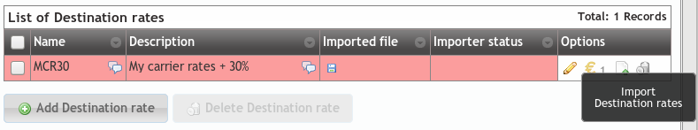

.. _destination_rate:

#################
Destination Rates
#################

- A Destination rate groups some prefixes with their cost details:

    - Cost per minute
    - Call establishment cost
    - Bill by seconds, by minutes, etc.

At this point, the future brand operator may have noticed that creating thousands
of pricing patterns would be a really annoying and time consuming task, as there
are 254 countries, each of them with their mobile networks, landline networks,
special service numbers, etc.

That's why the creation of destination reate is done using a
`CSV <https://es.wikipedia.org/wiki/CSV>`_ file. If you still want to create data
manually, check section :ref:`Creating a destination rate`

********************
Importing a CSV file
********************

The first step is creating an empty rating plan to import the prices in (section
**Brand configuration** > **Destination rates**):

This is the key button for the massive pricing pattern import process:

We can select which column contains which field, in case we want to import a
`CSV <https://es.wikipedia.org/wiki/CSV>`_ file in a non-recommended format. We
can also decide whether to import the first line or discard it as it may have
titles instead of data.

.. hint:: The importing process is done in background, letting the brand operator
   continue doing other stuff while it is finished.

CSV format
==========

Although the above window allows importing non-recommended format CSV files,
we encourage you to import a file in the proposed format, as it will make
this process much easier.

You can find a sample CSV for importing `here <https://raw.githubusercontent.com/
irontec/ivozprovider/artemis/web/admin/samples/pricesSample.csv>`_.

The order of the columns should be:

- Destination name
- Destination prefix (E.164 with + sign)
- Per minute charge
- Establishment cost
- Billing period in seconds

.. note:: It is recommended to double quote alphanumeric entries, though
   it is not compulsory for single word entries (or entries without odd symbols).
   **If they contain any comma, they MUST be quoted**.

.. error:: Floating numbers **MUST use point as decimal separator**.

.. note:: Numeric entries can be quoted with double quotes, but it is
   not mandatory.

.. warning:: The price of the call will be increased every billing period unit.

    - If *billing period* is set to 1, every second the price will be increased
      *price per minute* divided by 60 (bill by seconds).

    - If *billing period* is set to 60, every minute the price will be increased
      *price per minute* (bill by minutes).

You can download the imported file of the destination rate. Take into account that while importing
over existing data, the mathching values are overwritten and the not matching are kept. This allows
downloading the imported file, changing some values and importing pricing back.

Once the import process is over, we only have to include this destination rate into some
rating plan and bind it to the companies we want following the procedure explained in
:ref:`Rating plans`.
