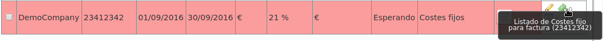

########
Invoices
########

**Invoices** section lets **brand operator** to generate invoices to issue to its
clients.

This is the process to add a create a new invoice:

.. image:: img/invoice_add.png
    :align: center

.. glossary::

    Number
        Will be included in the invoice and shows the invoice number

    Company
        The company whose calls will be invoiced

    Start/End date
        The time period of the calls that will be invoiced

    Taxes
        Taxes to add to the final cost (e.g. VAT)

    Template
        Invoice template that will be used

Let's add some fixed costs to this invoice:

Select previously defined fixed costs and their amounts:

.. image:: img/invoice_add3.png
    :align: center

At this point, we can generate the invoice pressing this button:

.. image:: img/invoice_add4.png
    :align: center

Pressing this button we can see which calls have been included in the invoice:

.. image:: img/invoice_add5.png
    :align: center

And pressing this one we can download the invoice in PDF format:

.. image:: img/invoice_add6.png
    :align: center

.. warning:: End date must be a past date. In other words, it is not allowed to
   generate invoices for future dates o dates including today.

.. error:: All the calls of the selected period must be billed.
