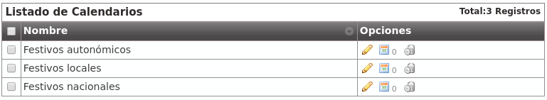

*********
Calendars
*********

Calenders are used to define what days are considered as holiday. Like
schedules, multiples calendars can be combined.

Let's imagine three calendars with the following configuration:

Calendar creation process only requires a name. Once created, we can add what
days will be holidays using the buttons in its row:

.. image:: img/calendars_add_day.png

From this moment on, the calendar has the 1st of January of 2016 as holiday
date with the locution "Happy New Year".

.. warning:: Calendars logic is opposite to Schedulers: If a day is not defined
   as holiday in any of the calendars, it will considered a normal day and no
   filtering will be applied.

.. hint:: Holidays without special locutions will apply the external call filter
   holiday generic locution (see below).

.. rubric:: Create a new External call filter