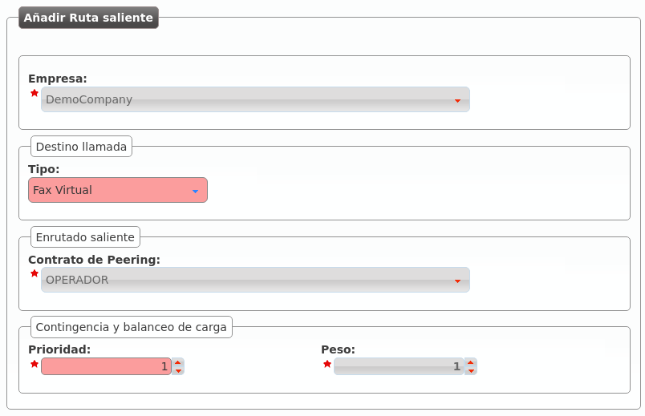

.. _faxing_system:

##################
Virtual Fax System
##################

IvozProvider includes a simple but efficient *faxing* solution that allows:

- Sending PDF files via Fax.

- Receiving faxes through email or check them through the web portal.

.. error:: IvozProvider uses
   `T.38 <http://www.voip-info.org/wiki/view/T.38>`_ for both sending and receiving
   faxes. Brand Operator must use *peering contracts* that have support for it.

**********************
Creating a virtual fax
**********************

This is the interface that turns up when we create a new fax in section
**Company configuration** > **Virtual Faxes**:

.. image:: img/fax_add.png
    :align: center

Fields are nearly self-explanatory:

.. glossary::

    Name
        Used by remaining section to reference a fax

    Email
        Email address when we want to receive incoming faxes (if we check 'Send
        by email')

    Outbound DDI
        DDI used as source number for outgoing faxes

To receive faxes in this DDI, we need to point it to our new fax in the section
**DDIs**:

.. image:: img/fax_ddi.png
    :align: center

Brand Operator can choose one or more *Outgoing Routes* for sending faxes:

This route applies to all faxes sent by selected company (or for all companies).

.. note:: *load-balancing* y *failover* logics described in :ref:`previous sections <routes_metrics>`
   apply to faxes too.

.. important:: If no fax-specific route is defined, faxes will be routed using
   standard call routes.

*************
Sending a fax
*************

Sending a fax is an easy task. First, we upload de PDF file and set the destination:

.. image:: img/fax_send.png
    :align: center

The list shows the fax and its status:

.. image:: img/fax_send2.png
    :align: center

**********************
Incoming faxes display
**********************

Apart from being received by mail, faxes can be watched and downloaded within
the web portal too:

.. image:: img/fax_list.png
