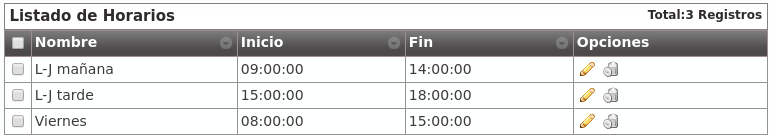

*********
Schedules
*********

The section **Company configuration** > **Schedule** allows to configure
different time gaps when an :ref:`external DDI <ddis>` will be available.

The screen displayed to the company administrator looks like this:

.. image:: img/timetables_add.png

With the above configuration, we have defined a morning schedule that will be
applied from Monday to Thursday.

We can also define an afternoon schedule for Monday to Thursday too:

And apply a different time gap for the Fridays:

.. image:: img/timetables_add3.png

We have the following time gaps that combined will determine our company
office schedule.

.. warning:: The schedule will be defined by combining the active time gaps:
   Any time outside this grouped gaps will be considered out-of-schedule.
