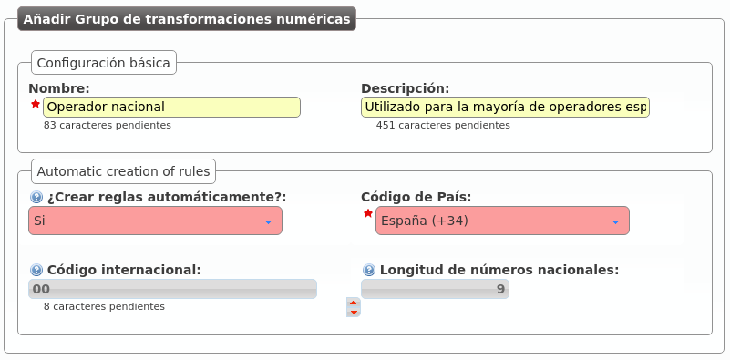
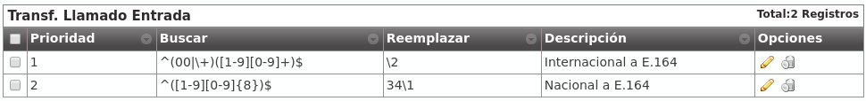

.. _numeric_transformations:

##########################
Transformaciones numéricas
##########################

********
Concepto
********

**IvozProvider** está diseñado con la intención de **poder dar servicio en cualquier lugar del planeta**, no solamente en el país originario de la solución.

Un concepto muy importante para conseguir este objetivo es el de las transformaciones númericas, que consisten en la **adaptación de los distintos sistemas de numeración de los países del mundo** definidos en `E.164 <https://www.itu.int/rec/T-REC-E.164/es>`_ **a un formato neutro**.

La sección que le permite configurar al operador de marca todo lo relativo a **Transformaciones numéricas** es:

.. image:: img/numeric_transformations_section.png
    :align: center

En concreto, se distinguen 2 casos:

Adaptación en entrada
=====================

Cuando una llamada entra a IvozProvider procedente de un operador con el que tenemos un acuerdo de *peering*, hay que adaptar las numeraciones que hacen referencia a:

- Origen de la llamada.

- Destino de la llamada.

En función del país del operador indicará los números internacionales de una forma distinta. En el caso de un operador español, por ejemplo:

- Utilizará 00 + 33 + número para una llamada con origen francés.

- Puede que muestre las numeraciones internacionales sin el 00.

- Es probable que si la llamada procede del mismo país del operador, no se muestre el prefijo del país (911234567 en lugar de 00 + 34 + 911234567)

En el caso de un operador de Ucrania, que no utiliza 00 como código internacional:

- Utilizará 810 + 33 + número francés para el mismo número.

- Puede incluso que aparte del código internacional (00 en la mayoría de países del mundo) un operador concreto anteceda sus números con un prefijo concreto.

El objetivo de la adaptación de entrada es que, independientemente de la notación utilizada por el operador, la llamada se acabe en un formato homogéneo y común.

.. _e164:

.. important:: Este formato común se suele llamar E.164 y muestra los números sin el código internacional y con el prefijo de país: e.g. 34911234567

Adaptación en salida
====================

Del mismo modo que el origen y el destino se tiene que adaptar en entrada, habrá que adaptar también las numeraciones en salida en función del operador por el que se vaya a sacar la llamada.

Por ejemplo, para una llamada a un número español:

- Operador español: El destino vendrá en E164 (34911234567) y habrá que quitar el prefijo de país: 911234567.

- Operador francés: El destino vendrá en E164 (34911234567) y habrá que añadir el código internacional: 0034911234567.

.. note:: En resumen, consiste en entregar origen y destino en el formato en el que el operador elegido los espera, para que la llamada progrese con normalidad.

.. tip:: Las transformaciones numéricas utilizan `expresiones regulares <https://es.wikipedia.org/wiki/Expresi%C3%B3n_regular>`_ muy simples para describir los cambios a realizar en las numeraciones. En Internet se pueden encontrar múltiples tutoriales sobre el uso básico de expresiones regulares.

**********************************
Transformación 'Operador Nacional'
**********************************

IvozProvider permite crear automáticamente las reglas de transformación típicas de la mayoría de países.

Para crear el set de reglas necesarias para los operadores españoles, basta con:

Las reglas que se han autocreado realizan las modificaciones adecuadas para operadores nacionales que muestren las numeraciones siguiendo estas reglas:

- Número español: se muestra sin código internacional y sin el 34.
- Número internacional: se precede de 00 y del código del país.

Los *sets* de transformaciones numéricas se asignan a **PeeringContracts**, tal y como veremos en la siguiente sección. Este *set* será el adecuado para la mayoría de operadores españoles.

Analicemos el *set* para entender lo que hace cada regla de transformación:

.. image:: img/numeric_transformations.png

.. attention:: La creación automática genera las 8 reglas habituales en función de los parámetros especificados. Estas reglas se pueden editar después, el proceso de automatización termina una vez creado el set.

Adaptación en entrada
=====================

Aparece en azul en la imagen anterior:

- Izquierda llamado/destino

- Derecha llamante/origen

Tanto para el origen como para el destino las reglas que se aplican son las mismas:

- Las reglas se evalúan antes o después en función del campo **métrica** (de menor a mayor).
    - Si una regla no *matchea*, se evalúa la siguiente regla.
    - Si una regla *matchea*, no se evalúan más reglas.
    - Si ninguna regla *matchea*, no se aplica ningún cambio.

- El campo **Buscar** se evalúa contra el campo en cuestión (en el caso de la captura, contra el campo Llamado/Destino de una llamada saliente).

    - Métrica 1: Que empiece por (^) 00 o '+', seguido de un dígito del 1 al 9, seguido de 1 o más dígitos del 0 al 9 hasta el final ($).
    - Métrica 2: Que empiece por un dígito del 1 al 9, seguido de 1 o más dígitos del 0 al 9 hasta el final ($).

- El campo **Reemplazar** recoge las capturas del campo buscar (expresadas entre paréntesis, \1 para la primera, \2 para la segunda, etc.) y expresa cómo tiene que quedar el número:

    - Métrica 1: El campo mostrará solo el segundo elemento capturado (\2).
    - Métrica 1: El campo añadirá 34 al primer elemento capturado (\1).

- Explicación *en modo texto*:

    - Métrica 1: Quitar código internacional (00 o '+') si lo hay.
    - Métrica 2: Añadir 34 a los números españoles mostrados sin prefijo de país para que queden en E.164.

Adaptación en salida
====================

.. image:: img/numeric_transformations3.png

Siguiendo la misma lógica, estas 2 reglas realizan los siguientes cambos sobre el destino en llamadas salientes:

- Métrica 1: Si empieza con 34 seguido de más dígitos, quitamos 34. Convierte números españoles de E.164 a formato nacional.
- Métrica 2: Si no empieza por 34, añadimos 00. Convierte números internacionales de E.164 a formato internacional español.

.. attention:: **En resumen**: las transformaciones numéricas adaptan orígenes y destinos, a E.164 en entrada y a los formatos que los operadores esperan en salida, utilizando reglas con expresiones regulares y métricas agrupadas en *sets* que se asocian a **PeeringContracts**.

