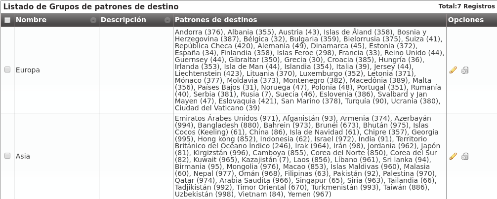

###############
¿A dónde llamo?
###############

En este punto de la configuración, tenemos que configurar IvozProvider para que las llamadas a los destinos externos que vayamos a probar salgan por el Contrato de *peering* que hemos configurado en el bloque anterior.

Para ello, en primer lugar, necesitamos que los números externos recaigan en un **patrón de destino** dado de alta con anterioridad.

.. _target_patterns:

*******************
Patrones de destino
*******************

Cuando un usuario marca un número externo, IvozProvider intenta calificar este número en uno de los patrones de destino definidos en esta sección:

.. image:: img/target_patterns_section.png
    :align: center

Lo más normal será que nos interese tener un patrón de destino por cada uno de los 254 países definidos en la `ISO 3166 <https://es.wikipedia.org/wiki/ISO_3166>`_. Por ese motivo, IvozProvider incluye estos países y sus prefijos de forma automática:

.. image:: img/target_patterns_default.png
    :align: center

Dentro de este listado aparece el prefijo de España, que será el grupo del número que probemos en este bloque:

.. image:: img/target_patterns_spain.png
    :align: center

.. warning:: Cada operador de marca puede elegir mantener estos patrones o borrarlos y crear los que le interesen. De hecho, aparte de prefijos, también se pueden definir expresiones regulares. e.g. Queremos crear un único patrón que englobe todas las llamadas: ^[0-9]+$.

.. danger:: Crear patrones de destino en base a expresiones regulares puede provocar que un número encaje en 2 patrones. Usar con responsabilidad.

******************
Grupos de patrones
******************

Como veremos en la sección de :ref:`rutas salientes <outgoing_routes>`, cada patrón de destino se vinculará a un Contrato de Peering concreto.

Por este motivo, puede ser interesante agrupar los patrones en grupos y así poder vincular un grupo entero a un Contrato de Peering.

Para ello se utiliza esta sección:

.. image:: img/target_patterngroups_section.png
    :align: center

Por defecto aparecen los 254 países agrupados en base a su continente definidos en la `ISO 3166 <https://es.wikipedia.org/wiki/ISO_3166>`_: 

.. important:: **En resumen**, cuando un usuario marca un número externo, IvozProvider busca el patrón de destino al que pertenece para saber por dónde tiene que sacar dicha llamada.

Para conseguir nuestro objetivo de llamar a un número español, no hemos tenido que modificar el contenido de partida de estas dos secciones :)

