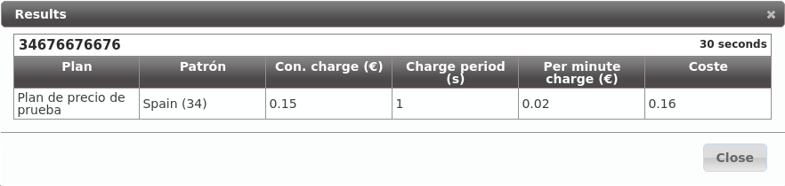
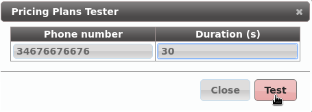
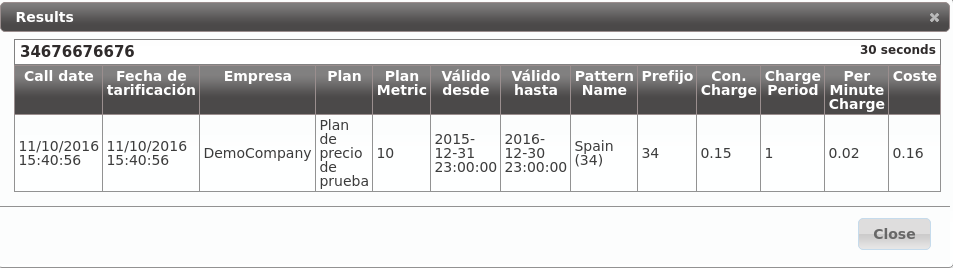

Llegados a este punto y estando deseosos como estamos de hacer nuestra primera llamada, habremos intentando llamar con la configuración actual pero...

.. _noplan_nocall:

##################################
Sin plan de precio, no hay llamada
##################################

Tal y como advertimos :ref:`cuando describimos las funciones del operador de marca <brand_responsibilities>`, el operador de marca era el **responsable de realizar la configuración necesaria para que todas las llamadas externas se puedan tarificar**.

.. note:: Se entiende por **tarificar** la **acción de poner precio** a una llamada que implique coste.

Para evitar que por un descuido el operador de marca no defina el precio para un tipo de llamada y llamadas que implican coste salgan a precio 0, **en el momento del establecimiento de una llamada se comprueba que la llamada se va a poder tarificar**.

.. error:: Si una llamada no se va a poder tarificar, IvozProvider no permitirá su establecimiento.

.. _price_pattern:

*************************
Crear un patrón de precio
*************************

Del mismo modo que existen los :ref:`patrones de destino <target_patterns>`, existen los **patrones de precio** y se configuran en esta sección:

.. image:: img/pricing_pattern_section.png

.. important:: Para que una llamada se considere tarificable, tiene que *matchear* con algún patrón de precio dado de alta previamente.

A diferencia de los patrones de destino, que vienen precreados con los 254 países del mundo, los patrones de precio no se crean ya que lo habitual es que un país se divida en muchos patrones de precio (redes GSM de un operador, numeraciones especiales, números fijos, números móviles, etc.).

Creemos el patrón de precio *Spain* para nuestra llamada saliente externa:

.. image:: img/pricing_pattern_add.png

.. _price_plan:

***********************
Crear un plan de precio
***********************

Un **Plan de precio** determina el coste de un tipo de llamada (de un patrón de precio) y se configura en esta sección:

.. image:: img/pricing_plans_section.png

Creamos un **plan de precio** para nuestro objetivo:

.. image:: img/pricing_plans_add.png

Y le añadimos el **patrón de precio** que hemos creado antes:

.. image:: img/pricing_plans_add_price.png

.. image:: img/pricing_plans_add_price2.png

.. note:: Los números decimales se tienen que introducir utilizando el "." como separador decimal (e.g. 0.02)

.. rubric:: Encontrar un plan de precios para un destino concreto

Para comprobar que hasta este punto la configuración es correcta, podemos **encontrar un plan de precio** para una llamada concreta pulsando:

.. image:: img/pricing_plans_find_plan.png

Introducimos el número destino en :ref:`formato E.164 <e164>`:

.. image:: img/pricing_plans_find_plan2.png

Y vemos que *matchea* con el **plan de precio** que acabamos de crear:

.. _pricing_plan_to_company:

*********************************
Vincular plan de precio a empresa
*********************************

Un **plan de precios** concreto se puede vincular a *n* empresas y corresponde al *Operador de marca* realizar esta vinculación.

Para ello, desde la sección **Configuración de Marca** > **Empresas**, seleccionando la empresa *demo*:

.. image:: img/pricing_plans_relate_company.png

La vinculación de **Planes de precio** y **Empresas** es efectiva en un período de tiempo concreto, de ahí que haya que seleccionar *Fecha inicio* y *Fecha fin*:

.. image:: img/pricing_plans_relate_company2.png

La **metrica** de la vinculación permite vincular más de un *plan de precios* a una empresa de forma coincidente en el tiempo, aunque ciertos destinos estén incluidos en más de uno de esos planes de precio.

.. attention:: Una llamada que puede tarificarse en base a más de un plan de precio vinculado a una empresa y activo en un momento dado lo hará en base al plan de precio con menor métrica.

.. tip:: Esto permite tener un *Plan de precios* general y matizar el coste de algún tipo de llamada en otro *Plan de precio* (móviles gratis, por ejemplo).

.. rubric:: Simular una llamada desde una empresa concreta

Del mismo modo que al crear un *Plan de precios* hemos comprobado que a nuestra llamada aplicaba dicho plan, podemos simular una llamada concreta en una empresa concreta y saber qué coste se le aplicaría:

.. image:: img/pricing_plans_simulate_companycall.png

Introducimos el número destino en :ref:`formato E.164 <e164>`:

Y vemos que efectivamente se le asignaría un precio correcto en base al plan de precio que acabamos de crear y vincular:

.. note:: En este punto, *Alice* debería de ser capaz de realizar llamadas nacionales externas, que se tendrían que cursar y tarificar con normalidad.

