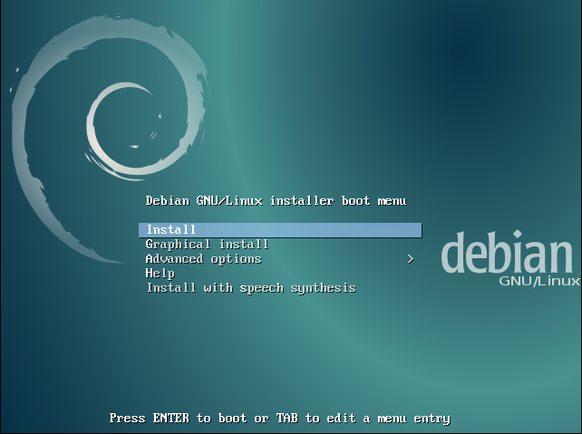
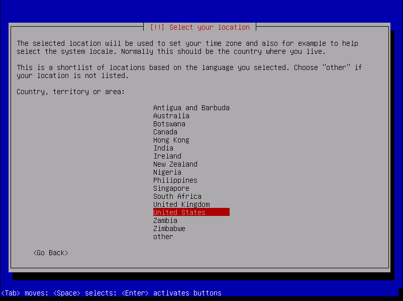
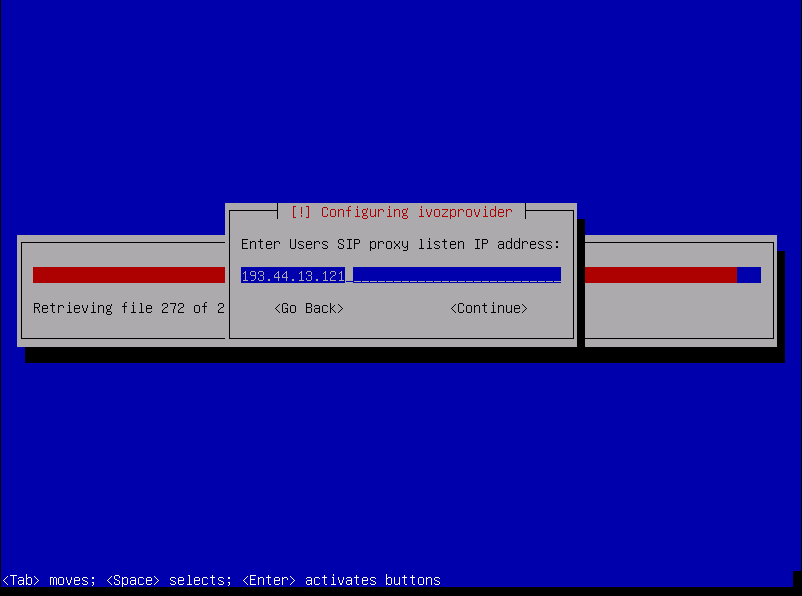
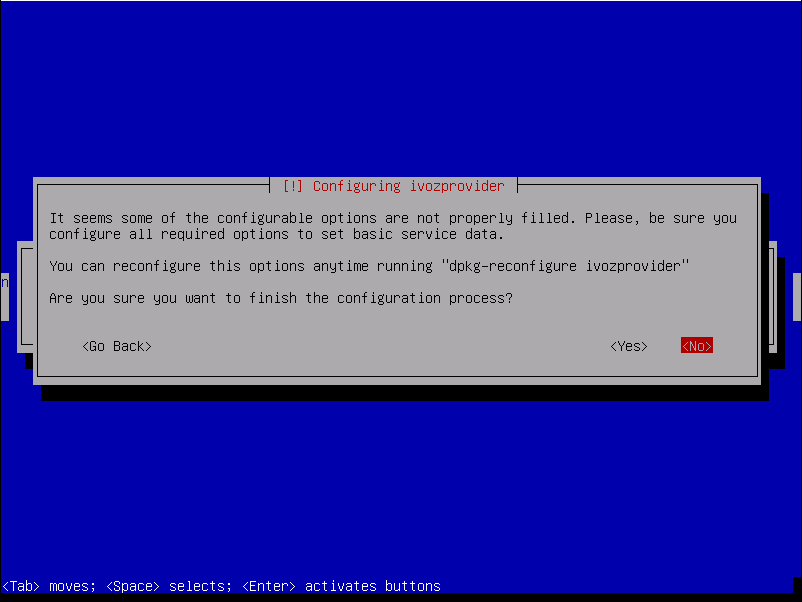

.. _instalacion-cd:

########################################################
Instalación por CD automático
########################################################

Puedes descargar uno de los `CDs automáticos de instalacion de IvozProvider <https://github.com/irontec/ivozprovider>`_ (generados mediante `simplecdd <https://wiki.debian.org/Simple-CDD>`_) en su versión estable o en una de las builds nocturnas:

.. important:: IMPORTANTE: Los CDs de instalación formatearán automáticamente el disco de la máquina.

* Configure la máquina para iniciar desde CD, mostrará el menún de instalación de Debian GNU/Linux.

.. note:: Si lo desea puede emplear la instalación gráfica del CD, pero los pantallazos a continuación se muestran con la instalación estándar.

* Seleccione el idioma de la instalación:

.. image:: img/installcd-language.png

* Seleccione la ubicación:

* Seleccione la configuración de hora:

.. image:: img/installcd-clock.png

.. note:: En este punto se realizará la configuración automática de red y particionado de disco, así como la instalación del sistema base.

* Configure IvozProvider:

.. image:: img/installcd-ivozmenu.png

Como hemos mencionado en los :ref:`requisitos-minimos` es necesario dos direcciones IPs para los proxies SIP de usuarios y proveedores.

Puede asignar sus valores ahora y configurar sus interfaces mas tarde, o bien puede mostar el siguiente menu para configurar estos valores más adelante.

También puede configurar el valor por defecto para acceder a MySQL en este momento.

.. image:: img/installcd-mysql.png

Y el idioma por defecto de los portales web:

.. image:: img/installcd-portallang.png

.. note:: No es preciso configurar todas estas cosas durante la instalación. En caso de que algún dato esté sin configurar se mostará un dialogo de aviso:

Por último, seleccione el disco donde se instalará el cargador de arranque GRUB.

.. image:: img/installcd-grub.png

Una vez reiniciada la máquina podrá entrar y acceder a través de los portales web!

