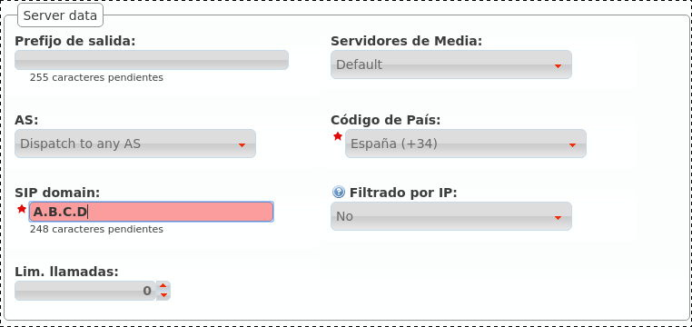

*******************************
Bloque 'Configuración de Marca'
*******************************

Para conseguir que esta DemoBrand tenga una compañía con 2 usuarios que se puedan llamar entre sí, vamos a tener que hacer muy poco en este bloque.

De hecho, al acceder a la sección **Empresas**, vemos que ya existe una compañía *DemoCompany* que podremos utilizar para cumplir nuestro ansiado objetivo :)

.. image:: img/company_list.png

Solo le falta una cosa a esta empresa, marcado con **EDIT** en la captura anterior.

.. _domain_per_company:

Dominio SIP de la compañía
==========================

Tal y como se introdujo en la sección anterior, es **imprescindible** que cada empresa tenga un dominio público que resuelva a la IP configurada para el :ref:`proxyusers`.

.. note:: El registro DNS puede ser de tipo A (soportado por todos los hardphones/softphones) o del tipo NAPTR+SRV.

Una vez configurado el dominio (por medio de procedimientos que escapan al objetivo de este documento), bastará con escribir el parámetro en el campo adecuado de nuestra empresa:

.. image:: img/set_domain.png

Una vez guardada la empresa, este dominio aparecerá en la sección descrita :ref:`en la sección anterior <god_sipdomains>`:

.. image:: img/domain_list.png

.. attention:: Es fundamental entender este bloque, sin un registro DNS correctamente configurado apuntando a la IP del Proxy de Usuarios, ¡fracasaremos en nuestro objetivo!

Esta es una buena señal para el dominio que acabamos de configurar, siempre y cuando en lugar de 10.10.3.10 aparezca la IP pública configurada en :ref:`proxyusers`.

.. image:: img/dominio_bien_configurado.png

.. danger:: ¿Se ha insistido suficiente en que sin un registro DNS correctamente configurado apuntando a la IP del Proxy de Usuarios no funcionará nada?

.. _dnshack:

No tengo tiempo para crear registros DNS
----------------------------------------

Todo lo contado hasta este punto es verídico: a medida que vayamos creando marcas y éstas vayan creando empresas, cada una de ellas necesitará un registro DNS.

Pero la primera empresa de la plataforma es especial y puede apoderarse de la IP del Proxy de Usuarios y usarla como si de un DNS se tratara:

A pesar de no ser un dominio, al estar usándose como tal, aparecerá en la sección de **Dominios**:

.. image:: img/fake_domain2.png

.. tip:: Es importante entender que este truco solo es válido para la primera empresa de la plataforma ;)

.. _emulate_company:

Emular la empresa Demo
======================

El proceso de emulación de empresa es idéntico al de emulación de marca, con la diferencia de que filtra el bloque 'Configuración de Empresa' en lugar del bloque 'Configuración de Marca'.

.. image:: img/emulate_company.png
    :align: center

.. image:: img/emulate_company2.png
    :align: center

Una vez emulada la empresa, la parte superior derecha de la pantalla mostrará que vamos por el buen camino :)

.. image:: img/emular_empresa.png
    :align: center

