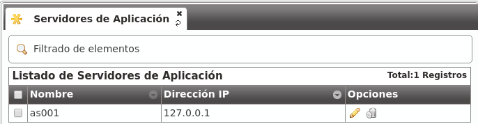
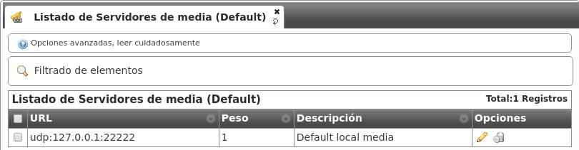
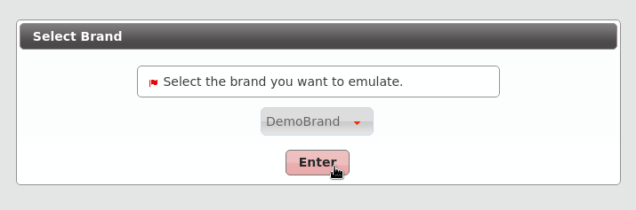

***************
Main Management
***************
   
.. important:: Any of the 2 Public IP addresses configured during the
   installation will work to acces the web portal. Default credentials are
   *admin / changeme*.

In this section will reference global administrator configuration options,
avaible in the menu (**Main management**) of the web portal (only visible to
God Admins):

.. image:: img/bloque_god.png
    :align: center

Custom installation configuration
=================================

During the install process two IP addresses will be requested in order to run
the following two processes:

.. _proxyusers:

Users SIP Proxy
---------------

This is the SIP proxy exposed to the external world where users register their
terminals.

The value displayed in the section **Proxy users** will show the IP address
entered during the installation process.

.. image:: img/proxyusers.png

Providers SIP proxy
-------------------

This is the SIP proxy exposed to the external world in charge of connecting
the provider that brand aministrators will configure for *peering*.

The value displayed in the section **Proxy trunk** will show the IP address
entered during the installation process.

.. image:: img/proxytrunks.png

.. note:: Only the IP address will be entered as the port will be always 5060
   (5061 for SIP over TLS).

.. danger:: This 2 values can be changed from the portal, but they must always
   have the same IP address that proxy process listen to requests.

Standard global configuration
=============================

The installation process includes other global values that are the same in
any standalone IvozProvider installation and can also be checked from the
web interface.

Application Servers
-------------------

The section **Application Servers** will list the IP address where the existing
Asterisk processes will listen for request, and like previously mentioned,
can scale horizontaly to adapt the platform for the required load.

Contrary to the Proxies, Asterisk is not exposed to the external world, so
for a standalone installation there will only be one listening at 127.0.0.1.

.. note:: The listening port will not be displayed in the field because it will
   always be 6060 (UDP).

.. important:: As soon as another Application Server is added, the proxies will
   try to balance load using it. If no response is received from added
   Application server, it will be disabled automatically.

Media relay
-----------

Media relays are in charge of bridging RTP traffic of established calls. Like
the Application Servers, they can scale horizontally as much as required.

Media relays are organized in groups so they can be assigned to a company. Each
element of the group has a **metric** that allows non-equal load balancing
within the same group (i.e. media-relay1 metric 1; media-relay2 metric 2:
the second media relay will handle two times the calls than the first one).

.. hint:: The static assigment of media relay groups is not the common practice
   but allow us to assign strategic resources to companies that need a warranted
   service. The most common usage of this **groups of media relays** is to
   place them near the geographic area of the company (usually far from the
   rest of the platform systems) in order to reduce **latencies** in their
   conversations.

In a standalone installation, only one media relay group will be exist:

.. image:: img/media_relay_groups.png

By default this group only has a media server:

.. note:: The address displayed is the control socket, not the SDP address that
   will be included during SIP negociation. By default this alone media-relay
   will share the same IP address that the User's SIP proxy.

.. _god_sipdomains:

SIP Domains
-----------

The section **Domains** will display the SIP domains that points to our two
public IP addresses.

- Users SIP Proxy IP address
- Trunks SIP Proxy IP address

After the initial installation, there will be two domains, one for each address:

.. image:: img/domain_list_local.png

This domains will be used internally by a builtin DNS server included in the
solution.

.. attention:: As mentioned in the section :ref:`domain_per_company`, each
   company will require a DNS pointing to the users SIP proxy. Once configured,
   the domain will be displayed in this list so global administrator can check
   what domains are registered for each company.

Emulate the Demo brand
======================

After the initial installation, the platform will have an already created brand
called DemoBrand, that will be used for our goal: to have 2 telephones registered
that can call each other. 

Before going to the next section, is quite important to understand how the
**emulation** works.

- As global operator, you have access to the menu **Main management** only
  visible to *God* administators.

- Apart from that menu, you will also have access to the **Brand configuration**
  and **Company configuration** that will look more or less like this:

.. image:: img/emular_marca_prev.png
    :align: center

- Check following button

.. image:: img/emular_marca.png
    :align: center

- When pressed, a popup will be displayed:

- After selecting the DemoBrand brand, the icon will change and shows the
  emulted brand:

.. image:: img/emular_marca3.png
    :align: center

- The upper right corner of the portal will also display the brand that is being
  emulted:
  
.. image:: img/emular_marca4.png
    :align: center

What emulation means
--------------------

Basically, that **everything in the menu 'Brand configuration' will be relative
to the chosen brand** and is **exactly** the same menu entries that the brand
operator will see using its brand portal.

.. tip:: Ok, ok. maybe exactly is not totally accurate. The global operator is
   able to see some fields in some screens that other admins cann't (i.e. On
   Company edit screen, fields like 'Media relays' or 'Application server' are
   only configurable by the global operator.  
