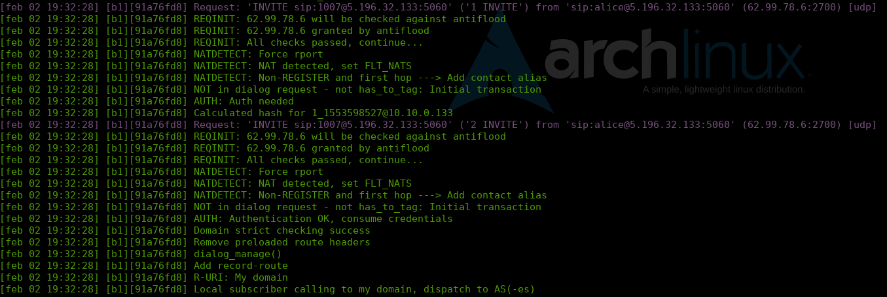

##########
Log viewer
##########

Although all production IvozProvider installations mantained by
`Irontec <https://www.irontec.com>`_ include a `Graylog server
<https://www.graylog.org/>`_, `journalctl
<https://www.freedesktop.org/software/systemd/man/journalctl.html>`_ is currently
the unique tool to inspect logs generated by different elements of the solution
in the past.

Asterisk CLI
=============

Asterisk CLI gives tons of realtime information too and are formatted beautifully
to detect possible configuration errors:

.. image:: img/asterisk_cli.png

You can access Asterisk CLI typing *ast* in the shell.

Kamailio realtime log viewing
=============================

You can see Kamailio logs in realtime too typing *kamtail-proxyusers* and
*kamtail-proxytrunks* in the shell:

