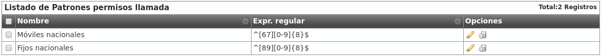
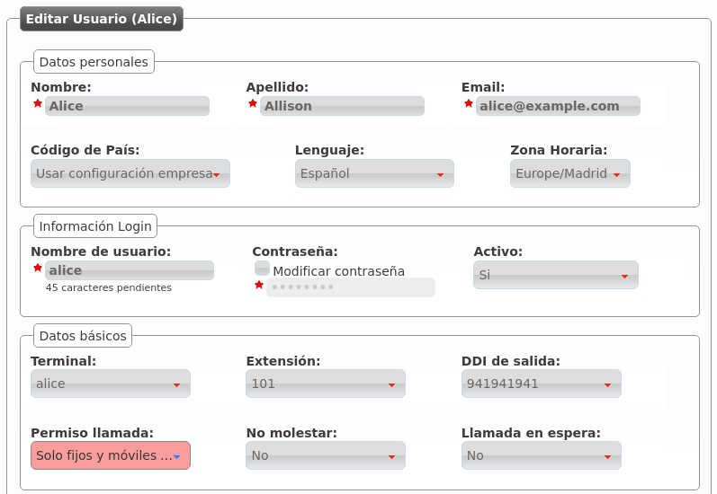

.. _call_permissions:

###################
Permisos de llamada
###################

Los **Permisos de llamada** determinan qué usuarios pueden llamar a qué destinos internos.

.. attention:: Las extensiones internas son accesibles por todos los usuarios, **los permisos de llamada solo aplican a llamadas externas**.

La configuración de **permisos de llamada** tiene 2 partes:

- Clasificar las llamadas en determinados tipos utilizando **expresiones regulares** [*]_:

    - A nivel de marca: **Configuración de Marca** > **Patrones de permiso genéricos**.

    - A nivel de empresa: **Configuración de Empresa** > **Patrones de permisos de llamada**.

- Definir políticas para los patrones deseados: **Configuración de Empresa** > **Permisos llamada**

*******************
Patrones de permiso
*******************

La clasificación de llamadas se realiza en las secciones indicadas a nivel de marca o a nivel de empresa.

.. note:: Cuando un operador de marca crea una empresa, todos los **Patrones de permiso genéricos** definidos en ese momento a nivel de **Configuración de Marca** se copian a **Configuración de Empresa** > **Patrones de permisos de llamada**. De esta forma, el operador de marca puede definir los más habituales y evitar este trabajo a los administradores de empresa.

La creación de nuevos patrones es muy simple:

.. image:: img/permissions_patterns.png

Este nuevo patrón de permisos engloba las llamadas que comiencen por 6 o 7 y sigan con 8 dígitos del 0 al 9. Es decir, engloba todas las numeraciones móviles nacionales.

Otros patrones de permisos que pueden resultar interesantes son:

- Fijos nacionales (incluyendo numeraciones especiales: 902, etc.): ^[89][0-9]{8}$
    - Un 8 o un 9 seguido de 8 dígitos.

- Fijos nacionales (excluyendo numeraciones especiales: 902, etc.): ^[89][1-9][0-9]{7}$
    - Un 8 o un 9, seguido de 1 dígito del 1 al 9, seguido de 7 dígitos.

- Llamadas internacionales: ^00[0-9]+$
    - 00 (código internacional) seguido de 1 o más dígitos.

- Llamadas a Reino Unido: ^0044[0-9]+$
    - 00 (código internacional), 44 (código de UK), seguido de 1 o más dígitos.

.. rubric:: Formato de los números externos

Las expresiones regulares de los patrones de permiso tienen que utilizar el formato que utilice un usuario del mismo país que la compañía a la hora de llamar.

Es decir, un usuario (español, porque tal y como veremos los usuarios tienen también un código de país) de una empresa de española llamará a números móviles, por ejemplo, así: 676 676 676.

.. danger:: No se utiliza código de país ni formato E.164, **se escriben las expresiones regulares tal y como llamaría un usuario con el mismo código de país que la empresa en cuestión**.

*******************
Permisos de llamada
*******************

La definición de un **Permiso de llamada** utiliza una lógica más fácil de describir con un ejemplo.

Imaginemos que tenemos los siguientes **patrones de permisos**:

Podríamos definir un **Permiso de llamada** como el que sigue:

.. image:: img/permissions_add.png

.. note:: La acción por defecto describe lo que hay que hacer con la llamada una vez que se han evaluado todas las reglas (permitir/rechazar).

Editamos el **permiso de llamada** que acabamos de crear para añadir las reglas necesarias:

.. image:: img/permissions_add2.png

La **métrica** determina el orden de evaluación de las reglas y la acción lo que se hará con la llamada en caso de *matchear* (permitir/rechazar).

.. image:: img/permissions_add3.png

Una vez hecho lo propio para el otro **patrón de permisos**, nuestro **permiso de llamadas** quedará como sigue:

.. image:: img/permissions_add4.png

Ya solo faltaría añadírselo a un usuario concreto en la sección **Configuración de empresa** > **Usuarios**:

Desde este momento, Alice solo podría llamar a extensiones internas (siempre están permitidas) y a móviles y fijos nacionales.

.. [*] https://es.wikipedia.org/wiki/Expresi%C3%B3n_regular

