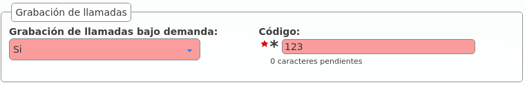

.. _call_recordings:

##############
Call recording
##############

.. attention:: Beware that local legislation may enforce to announce that the 
   call is being recorded (sometimes to both parties). You should include 
   a recording disclaimer in your welcome locutions for DDIs with automatic 
   recording enabled.

IvozProvider supports two different ways of recording calls:

- **Automatic recordings** for the incoming/outgoing calls that use a 
  :ref:`External DDI <external_ddis>`.
  
- **On demand recordings** requested by a user during a call.

************************
Automatic DDI recordings
************************

In this type of recording, **the whole conversation will be recorded**: from 
the start until it finishes. 

Two different scenarios:

- **Incoming calls to a DDI**: The call will continue until the external 
  dialer hangups (no matter whom is talking to).

- **Outgoing calls using a DDI** as :ref:`Outgoing DDI <external_ddis>`: the 
  recording will continue as long as the external destination keeps in the
  conversation.

.. attention:: Take into account that the call will be recorded while the 
   external entity is present, even it the call is being transfered between
   multiple users of the platform. 

.. rubric:: Record all the calls of a DDI

To enable this feature, edit the DDI and configure the field under the section
recording data: 

.. image:: img/recordings_ddi.png

There are 4 available options:

- Disable recordings
- Enable incoming recordings
- Enable outgoing recordings
- Enable all call recordings 

********************
On demand recordings
********************

The *on-demand* recordings must be enabled by the *brand administator* for the
companies that request it. This can be done in the companey edit screen:

.. warning:: Contrary to the :ref:`Services <services>` mentioned in the
   previous section, the on demand record are actived within a conversation.

Contrary to automatic ones, on demand recording can be stoped using the same 
process that started them.

Activated using the *Record* key
================================

Some terminals (for example, *Yealink*) support sending a `SIP INFO 
<https://tools.ietf.org/html/rfc6086>`_ message during the conversation with a
special *Record* header (see `reference <http://www.yealink.com/Upload/document/UsingCallRecordingFeatureonYealinkPhones/UsingCallRecordingFeatureonYealinkSIPT2XPphonesRev_610-20561729764.pdf>`_). 
This is not a standard for the protocol, but being Yealink one of the supported
manufacturers of the solution, we include this kind of on-demand recording.

.. important:: For this recording requests, the configured code doesn't matter
   but the company still must have on demand records enabled. 

To start or stop this kind of recordings, just press the Record key in the 
terminal and the system will handle the sent message.

Activated using *DTMF* codes
============================

The more traditional approach for this feature is to press a combination of 
keys during the call. Some notification will be played and the recording will 
start or stop. This combination is sent to the system using `DTMF tones
<https://es.wikipedia.org/wiki/Marcaci%C3%B3n_por_tonos>`_ using the same audio
stream that the conversation (as mentioned in `RFC 4733 
<https://tools.ietf.org/html/rfc4733>`_).

IvozProvider supports this kind of on demand record activation but with an 
important downside. In order to capture this codes, the pbx must process each
audio packet to detect the code, avoiding the direct flow of media between the
final endpoints.

.. important:: Enabling this record mode highly affects the performance of the
   platform. Use at your own risk.

Activated using a frustated blind transfer
==========================================

There is a tricky way to access this feature for terminals that does not support 
the INFO message and don't want its audio to be parsed:

.. danger:: This method is a workaround for those terminals that does not support
   the native *Record* key activation (recommended). Take into account that not 
   all terminals will behave the same way while performing the transfer described 
   in this section.

The keys for this methods are:

- It's not activated using a code during the conversation.

- It's activated making a **blind transfer** to the on demand record code.

- The system will understand this as a request to record and will reject the transfer.

- The user will continue with the existing call and keep talking.

.. rubric:: Why this method does even exist?

The reason behind this tricky method is based, as explained in the previous 
block, on the design of the :ref:`architecture` and the :ref:`RTP audio 
flow <audioflow>`.

***************
Recordings list
***************

The *company administrator* can access to all the recordings in the section 
**Company configuration** > **Recordings**:

.. image:: img/recordings_list.png

Recordings can be heard from the *web* or downloaded in MP3 format:

.. image:: img/recordings_list2.png

If the recording has been started on demand, it will also include the user 
that requested it:

.. image:: img/recordings_list3.png

