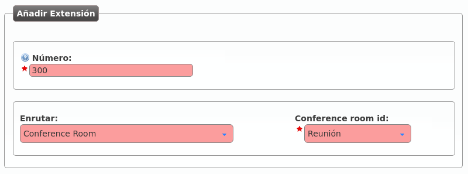

.. _conference_rooms:

##########################
Salas de audioconferencias
##########################

IvozProvider provee la funcionalidad de salas de audiconferencias que se pueden 
configurar en la sección **Configuración de empresa** > **Salas de conferencias**.

.. rubric:: Crear una sala de audioconferencias

La siguiente imagen ilustra el proceso de creación de una sala de 
audioconferencias:

.. image:: img/conference_room.png

.. glossary::

    Nombre
        Nombre por el que se referenciará la sala en otras secciones

    Límite de participantes
        Apartir del número especificado, no se admitirán más miembros.

    Protegido con contraseña / Código PIN
        Se puede forzar al sistema a pedir un PIN para poder entrar. En caso de 
        activar, se puede introducir un PIN numérico.

.. note:: Para desactivar el límite de participantes, configurar su valor a 0.

.. rubric:: Asociar una extensión o un DDI externo

De poco sirve una sala de conferencias si no podemos meter a los participantes 
a la misma.

Para poder meter participantes, el primer paso sería asociar una extensión 
interna a la sala, para poder desvíar a la misma, transferir, etc.:

En la siguiente sección veremos como también se puede apuntar un :ref:`DDI 
externo <external_ddis>` a una sala de conferencias, para meter en la sala a 
gente externa a la empresa.

.. hint:: Existen otras formas de meter un participante externo a una sala de 
   audioconferencias sin dedicar un DDI externo: que alguien de dentro 
   transfiera la llamada a la extensión de la sala, acceder por medio de un 
   IVR, etc.

