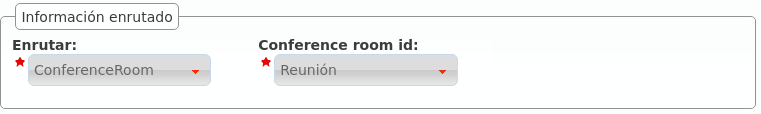

.. _external_ddis:

#############
DDIs externos
#############

En la sección preliminar :ref:`settingup_ddi` se describió con todo detalle la configuración necesaria para configurar un DDI externo directo a un usuario.

Después de explicar las secciones anteriores, podemos llevar esta configuración un poco más allá:

*****************
Filtro de entrada
*****************

Podemos seleccionar el **Filtro de entrada externo** configurado en :ref:`la sección anterior <external_filters>`.

.. image:: img/ddi_edit.png

.. _routing_logics:

************
Tratamientos
************

Vemos que tenemos más opciones aparte de enviar la llamada, una vez superado los filtros de horario y calendario (y previa locución de bienvenida), directamente a un usuario:

- :ref:`huntgroups`

.. image:: img/ddi_edit2.png

- :ref:`IVR Genérico <generic_ivrs>`

.. image:: img/ddi_edit3.png

- :ref:`IVR a medida <custom_ivrs>`

.. image:: img/ddi_edit4.png

- :ref:`conference_rooms`

.. hint:: También podemos apuntar el DDI a un :ref:`fax virtual <faxing_system>`, pero esto se verá en el siguiente bloque.

