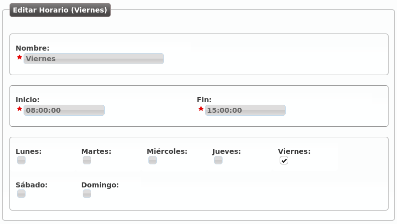

.. _external_filters:

##########################
Filtros de entrada externo
##########################

Una de las configuraciones más habituales que todo administrador de empresa 
querrá realizar en un momento dado es poner filtros de horario y de calendario 
a sus :ref:`external_ddis`.

Para ello, el primer paso es crear un horario.

.. rubric:: Crear un horario

La sección **Configuración de Empresa** > **Horarios** permite definir los 
tramos horarios en los que un :ref:`DDI externo <external_ddis>` está dentro 
de horario.

La interfaz que se le presenta al administrador de empresa cuando añade un 
horario es la siguiente:

.. image:: img/timetables_add.png

Con la configuración anterior, hemos definido el tramo horario de mañana de una 
empresa de Lunes a Jueves.

Sigamos con el ejemplo y definamos el tramo horario de tarde de Lunes a Jueves:

.. image:: img/timetables_add2.png

Y el horario reducido de los viernes:

Ya tenemos los siguientes tramos horarios que, combinados, describen un horario 
de oficina tradicional:

.. image:: img/timetables_add4.png

.. warning:: Los horarios definen, una vez sumados, los tramos horarios activos: 
   toda hora que no caiga dentro de uno de los tramos agrupados será 
   considerada como llamada fuera de horario.

.. rubric:: Crear un calendario

Los calendarios definen, una vez sumados, los días que se tienen que considerar 
festivos.

Imaginemos que creamos 3 calendarios tal que:

.. image:: img/calendars_list.png

La creación de calendarios solo requiere dar un nombre al mismo, una vez creado 
hay que añadir días festivos a dicho calendario pulsando el botón de la derecha 
del lápiz:

.. image:: img/calendars_add_day.png

Desde este momento, es calendario tiene marcado el día 1 de Enero de 2016 como 
día festivo con locución de festivo especial llamada "Feliz año".

.. warning:: Los calendarios tienen una lógica contraria a los horarios: si un 
   día concreto no está definido como festivo en uno de los calendarios, será 
   considerado como día laborable.

.. hint:: Si un día es festivo en un calendario y no hay locución de festivo 
   especial, se reproducirá la locución de festivo del filtro de entrada 
   externo (ver más abajo).

.. rubric:: Crear un filtro de entrada externo

Una vez que tenemos unos horaris y unos calendarios creados, llega el momento 
de agruparlos en lo que en IvozProvider se conoce por **Filtro de entrada 
externos**.

El interfaz que se le presenta al administrador de empresa es el siguiente:

.. image:: img/external_call_filter.png

.. glossary::

    Nombre
        Nombre con el que se referenciará este filtro.

    Locución de bienvenida
        Esta locución se reproduce siempre que la llamada no se va a rechazar 
        por festivo o fuera horario (es decir, en una hora normal de un día 
        normal).

    Locución de festivo
        Esta locución se reproducirá cuando el día de hoy esté marcado como 
        festivo en uno de los calendarios y no se haya definido una locución 
        de festivo especial en dicho calendario para ese día.

    Tipo de desvío festivo
        Si una llamada entra un día festivo, aparte de la locución de festivo 
        (si la hay), se puede realizar un desvío a un buzón de voz, a un número 
        externo o a una extensión interna. En el ejemplo, la llamada se 
        desviará los días festivos al móvil 676 676 676.

    Locución fuera horario
        Esta locución se reproducirá cuando, siendo un día no festivo, la hora 
        actual no esté dentro de ningunos de los horarios vinculados.

    Tipo de desvío fuera horario
        Lo mismo que en festivo, pero para el caso de fuera horario. En la 
        imagen, no se ejecutaría ningún desvío.

    Calendarios
        Permite seleccionar múltiples calendarios, de forma que el calendario 
        del filtro es la suma de todos ellos.

    Horarios
        Permite seleccionar múltiples horarios, de forma que el horario del 
        filtro es la suma de todos ellos.

.. attention:: El día festivo tiene prevalencia sobre el fuera horario. Primero 
   se evalúan los calendarios, luego los horarios.

En la siguiente sección veremos como este filtro se asigna a los 
:ref:`external_ddis` que queramos, definiendo así el comportamiento de los 
mismos fuera de horario y en días festivos, así como dentro de horario en el 
caso de *setear* locución de bienvenida en el filtro.

