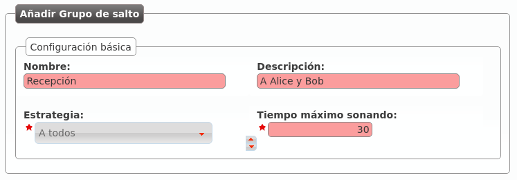
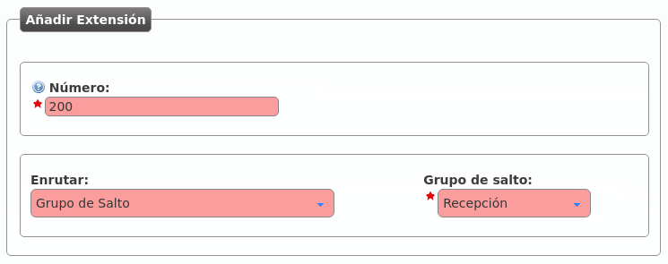

.. _huntgroups:

###############
Grupos de salto
###############

Los grupos de salto nos permiten definir lógicas de *ringado* más allá de la básica **llamada a usuario**.

Existen de varios tipos:

.. glossary::

    A todos
        La llamada suena en varios terminales a la vez durante el tiempo definido.

    Secuencialmente (una vez)
        Suenan los usuarios definidos, en el orden definido y durante el tiempo definido a cada uno de ellos. Al acabar la secuencia, la llamada se cuelga.

    Secuencialmente (infito)
        Suenan los usuarios definidos, en el orden definido y durante el tiempo definido. Al acabar la secuencia, se vuelve a iniciar la secuencia.

    Aleatoriamente
        Reparte las llamadas entre los usuarios elegidos de forma aleatoria, sonando cada uno de ellos el tiempo acordado. Una vez que suenan todos, la llamada se cuelga.

.. rubric:: Ejemplo 1: Grupo de salto *ringall*

Creemos por ejemplo un grupo de salto que llame a la par a nuestros 2 usuarios durante 30 segundos:

Pulsando el icono de las personas podemos añadir a Alice y Bob a nuestro grupo de salto:

.. image:: img/huntgroup_add2.png

.. rubric:: Ejemplo 2: Grupo de salto secuencial

Editemos ahora este grupo de salto para que llame 10 segundos a Alice y después 15 segundos a Bob, reiniciando la secuencia si ninguno de los 2 contesta:

.. image:: img/huntgroup_add3.png

En este caso tenemos que indicar una **prioridad** (los usuarios suenan de menos a mayor prioridad) y un tiempo de *ringing*:

.. image:: img/huntgroup_add4.png

.. hint:: Para que ciertas lógicas (desvíos, etc.) alcancen un **Grupo de salto**, basta con crear una extensión apuntando a dicho grupo de salto y utilizar esta extensión como destino de la lógica.

Creemos la extensión 200 que apunte a este grupo de salto:

