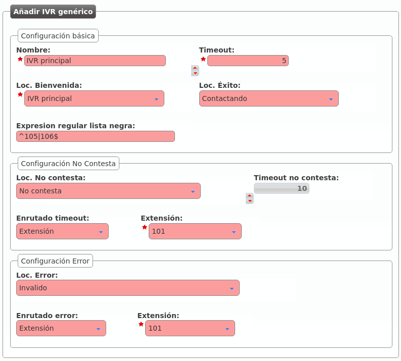
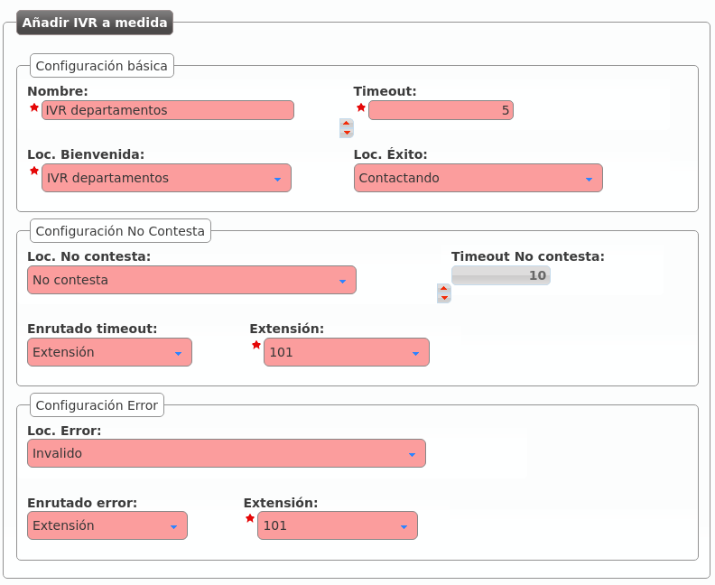

################################
Interactive Voice Response (IVR)
################################

Un IVR es la forma habitual de realizar **menús telefónicos** en los que **el llamante puede decidir el destino de su llamada sin más que pulsar dígitos** en base a las locuciones que se le van reproduciendo.

.. _generic_ivrs:

**************
IVRs genéricos
**************

En los IVR genéricos el llamante marca directamente una extensión interna que conoce (o que se le indica en la locución de bienvenida) y el sistema le pone en contacto con dicha extensión de forma automática:

Describamos cada uno de los parámetros de un IVR genérico:

.. glossary::

    Nombre
        Forma de referenciar el IVR

    Timeout
        Tiempo adicional al de la locución de bienvenida que el sistema espera a que el interlocutor marque los dígitos.

    Locución de bienvenida
        Locución que se le presenta al llamante invitándole a marcar la extensión con la que quiera hablar.

    Locución de éxito
        En caso de que la extensión marcada sea correcta, se reproducirá esta locución (típicamente dirá algo así como "Contantando...").

    Expresión regular lista negra
        Si queremos que alguna extensión interna no sea accesible desde el IVR, basta con añadirla aquí utilizando expresiones regulares. En el ejemplo, las extensiones 105 y 106 no serían accesibles desde el IVR y marcarlas provocaría que se activase la **Configuración de Error**.

    Configuración No contesta
        En caso de que la extensión destino no conteste en el tiempo indicado, se reproduce la locución indicada y se desvía al número externo, extensión interna o buzón seleccionado.

    Configuración Error
        Si lo que ha marcado el llamante no es válido (o no ha marcado nada), se reproduce la locución indicada y se desvía la llamada al número externo, extensión interna o buzón seleccionado.

.. _custom_ivrs:

*************
IVRs a medida
*************

A diferencia de los IVRs genéricos en donde el llamante solo puede marcar extensiones internas, los IVRs a medida permiten marcar dígitos que luego se pueden convertir a lo que el administrador de empresa desee.

.. hint:: El caso más típico es el IVR que dice algo así como "Marque 1 si quiere hablar con administración, marque 2 si quiere hablar con informática..."

Los campos que se presentan son prácticamente idénticos al IVR genérico:

La única diferencia es que no existe el campo **Expresión regular lista negra**, que carece de sentido en este tipo de IVRs.

Pulsando el botón de la siguiente imagen se pueden definir las equivalencias deseadas:

.. image:: img/ivr_custom2.png

En este caso se puede marcar 1, 2 y 3 (todo lo demás será considerado inválido y activará la **Configuración de Error**):

.. image:: img/ivr_custom3.png

- 1: Llamada a la extensión interna 200, creada :ref:`en la sección anterior <huntgroups>` y que apunta al grupo de salto *Recepción*.
- 2: Llama a la extensión interna 101.
- 3: Desvía la llamada al número externo 676 676 676.

.. note:: Cada una de las opciones del IVR a medida permite la selección de una locución que pisa a la **locución de éxito** si está definida. De esta forma aparte de tener una locución de éxito genérica con "Contactando" podríamos tener otra que dijera "Contactando con Administración, espere por favor".

