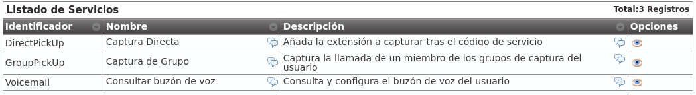
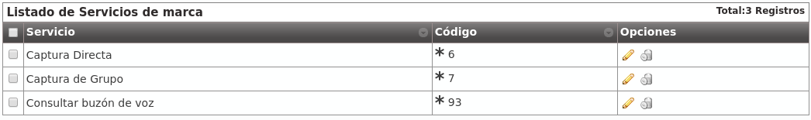

.. _services:

#####################
Servicios adicionales
#####################

Existen **servicios especiales** a los que se accede **marcando códigos** 
especiales **desde un terminal** de usuario **cuando éste está en reposo**.

.. danger:: Los servicios que se definen en esta sección **no son accesibles 
   en medio de una conversación**. Se activan **llamando** a los códigos que 
   se mencionarán, no marcándolos en medio de una conversación.

*********************************
Listado de códigos a nivel global
*********************************

En el momento de realizar esta documentación, existen los siguientes 
**servicios especiales** visibles en la sección **Gestión general** > 
**Servicios**:

.. glossary::

    Captura Directa
        Es el servicio que permite capturar metiendo el código que se asigne 
        seguido de la extensión del teléfono a capturar.

    Captura de Grupo
        Es el servicio que permite capturar el teléfono que esté sonando 
        dentro de tu(s) grupo(s) de captura.

    Consultar el buzón de voz
        Este servicio permite acceder a un menú de voz que te presenta los 
        mensajes de voz nuevos, viejos, etc. Es una alternativa a la recepción 
        de mensajes de voz vía correo electrónico.

A medida que la solución vaya evolucionando y surjan servicios nuevos, 
aparecerán en este listado para que el operador global sepa de su existencia 
y lo comunique a sus operadores de marca.

.. attention:: Este listado determina los servicios disponibles y los códigos 
   por defecto de las **nuevas marcas**.

.. hint:: Cambiar un código solo afecta a las marcas que se creen tras el 
   cambio.

**************************************************
Definición de servicios y códigos a nivel de marca
**************************************************

La sección **Configuración de Marca ** > **Servicios** permite al operador 
de marca:

- Redefinir el código de acceso por defecto a dichos servicios para las 
  empresas que a su vez no lo redefinan.

- Borrar servicios que no quieran que puedan utilizar sus empresas.

Por defecto este listado aparece con todas los servicios y los códigos 
configurados a nivel Global:

.. attention:: Este listado determina los servicios disponibles y los códigos 
   por defecto de las **nuevas empresas**.

.. hint:: Cambiar un código solo afecta a las empresas que se creen tras el 
   cambio. Borrar un servicio hace que no esté disponible para ninguna empresa 
   de la marca.

****************************************
Definición de códigos a nivel de empresa
****************************************

Cada empresa puede *pisar* los valores por defecto asignados por su *operador 
de marca* accediendo a **Configuración de Empresa** > **Servicios** y 
cambiando el código asignado.

.. rubric:: Empresa que quiere capturar con \*\* en lugar de con \*95:

.. image:: img/services_company_edit.png

.. hint:: Los servicios que el *administrador de empresa* borre no podrán ser 
   utilizados por sus usuarios.

