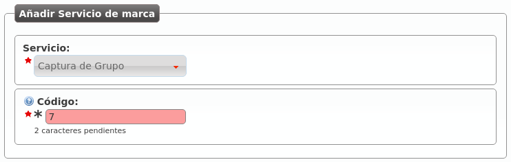
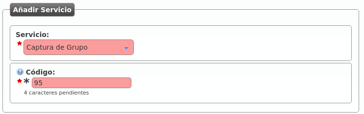
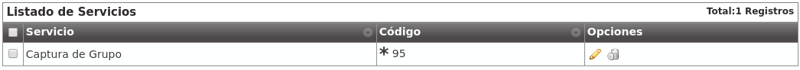

.. _services:

#####################
Servicios adicionales
#####################

Existen **servicios especiales** a los que se accede **marcando códigos** especiales **desde un terminal** de usuario **cuando éste está en reposo**.

.. danger:: Los servicios que se definen en esta sección **no son accesibles en medio de una conversación**. Se activan **llamando** a los códigos que se mencionarán, no marcándolos en medio de una conversación.

*********************************
Listado de códigos a nivel global
*********************************

En el momento de realizar esta documentación, existen los siguientes **servicios especiales** visibles en la sección **Gestión general** > **Servicios**:

.. image:: img/services_god.png

.. glossary::

    Captura Directa
        Es el servicio que permite capturar metiendo el código que se asigne seguido de la extensión del teléfono a capturar.

    Captura de Grupo
        Es el servicio que permite capturar el teléfono que esté sonando dentro de tu(s) grupo(s) de captura.

    Consultar el buzón de voz
        Este servicio permite acceder a un menú de voz que te presenta los mensajes de voz nuevos, viejos, etc. Es una alternativa a la recepción de mensajes de voz vía correo electrónico.

A medida que la solución vaya evolucionando y surjan servicios nuevos, aparecerán en este listado para que el operador global sepa de su existencia y lo comunique a sus operadores de marca.

.. attention:: Este listado no especifica el código de acceso al servicio, serán los operadores de marca los que especifiquen el código de acceso por defecto a los servicios que quieran hacer disponibles.

**************************************************
Definición de servicios y códigos a nivel de marca
**************************************************

La sección **Configuración de Marca ** > **Servicios** permite al operador de marca:

- Dar de alta, de entre los servicios disponibles, los servicios que quiere hacer disponibles a sus empresas.

- Asignar el código de acceso por defecto a dichos servicios.

Por defecto este listado aparece vacío y se pueden añadir servicios tal que:

.. note:: Los caracteres permitidos son 0-9, \* y #, un máximo de 3.

Imaginemos que añadimos los 3 disponibles:

.. image:: img/services_brand_list.png

Desde ese momento, las empresas podrían acceder a dichos servicios sin más que marcar los códigos elegidos.

.. hint:: El operador de marca puede elegir no dar acceso a sus empresas al servicio *Buzón de voz*, por ejemplo. Bastaría con no asignarle código.

****************************************
Definición de códigos a nivel de empresa
****************************************

Puede darse el caso que una empresa concreta esté habituada a otros códigos o, simplemente, prefiera otros.

Cada empresa puede *pisar* los valores por defecto asignados por su *operador de marca* accediendo a **Configuración de Empresa** > **Servicios**:

.. rubric:: Ejemplo: empresa que no quiere capturar con \*7 sino con \*95

Quedando la sección con:

.. note:: Los servicios que el *administrador de empresa* no redefina utilizarán el código por defecto asignado por el *operador de marca*.

