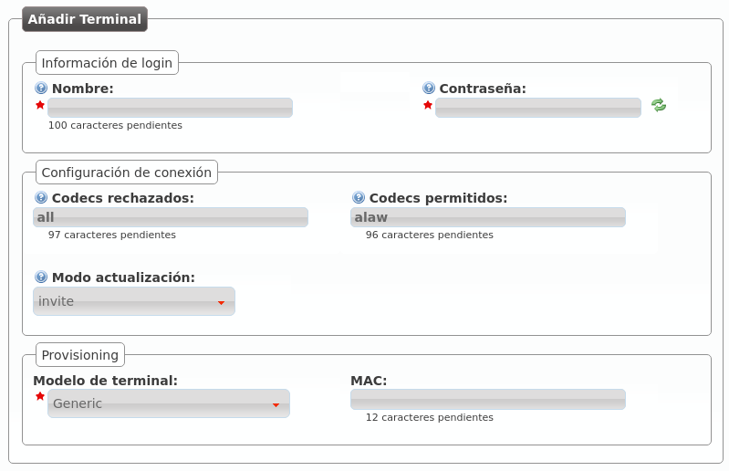

.. _terminals:

##########
Terminales
##########

La sección **Configuración de empresa** > **Terminales** permite dar de alta 
credenciales SIP que podrán ser utilizados por diversos dispositivos SIP para 
realizar y recibir llamadas de IvozProvider.

La mejor forma de entender la sección es crear uno nuevo y ver los campos que 
tenemos que cumplimentar:

.. glossary::

    Nombre
        Usuario que utilizará el terminal para presentarse ante IvozProvider y 
        para realizar la fase de autenticación SIP.

    Contraseña
        Contraseña que utilizará el terminal para responder a la fase de 
        autenticación SIP. Utilizar el generador automático de contraseñas para 
        cumplir los criterios de seguridad exigidos.

    Codecs rechazados/permitidos
        Indica las capacidades del terminal en lo que a codecs se refiere. 
        Primero se descarta los rechazados y posteriormente incluye los 
        soportados. Se recomienda dejar *alaw* como único soportado.

    Modo de actualización
        Indica si el terminal prefiere utilizar reINVITEs o UPDATEs para 
        actualizar la sesión. La sección de ayuda indica qué terminales suelen 
        requerir qué método. En caso de duda, utilizar *invite*.

    Modelo de terminal
        Indica el tipo de provisión que tendrá que recibir este terminal 
        concreto. En el apartado dedicado a la :ref:`provisión de terminales 
        <provisioning>` se verá que existen unos modelos con provisión 
        automática y se explicará todo en profundidad. En caso de no necesitar 
        provisión, utilizar *Generic*.

    MAC
        Campo necesario para modelos que utilizan el sistema de :ref:`provisión 
        de terminales <provisioning>` de IvozProvider. Recoge la `dirección 
        física <https://es.wikipedia.org/wiki/Direcci%C3%B3n_MAC>`_ del 
        adaptador de red del dispositivo SIP.

.. note:: **En la mayoría** de dispositivos, siempre que no requieran 
   provisión, **bastará con rellenar el nombre y contraseña**.

.. hint:: Una vez dado de alta el Terminal, en la mayoría de dispositivos 
   bastará con configurar nombre, contraseña y :ref:`dominio SIP de la 
   compañía <domain_per_company>` para poder llamar.

