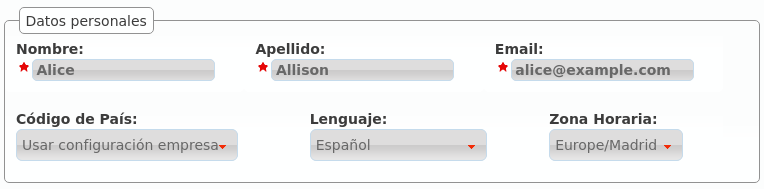
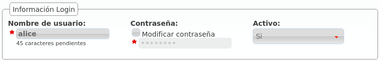
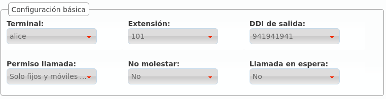
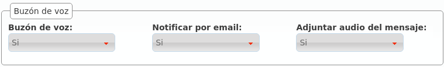
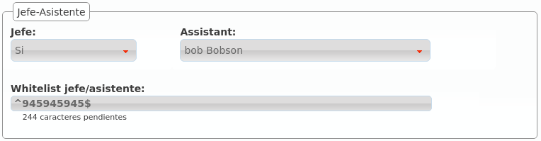
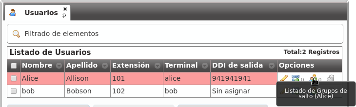
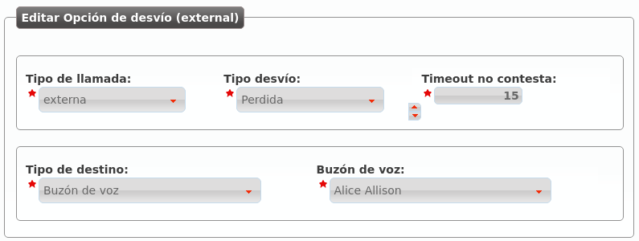

.. _users:

########
Usuarios
########

El proceso de instalación nos creó a *Alice* y a *Bob*, y esto nos permitió ahorrar mucho tiempo a la hora de conseguir que se llamarán entre ellos.

También nos permitió pasar un poco de puntillas por la sección de **Usuarios**, que ahora pasamos a definir en profundidad.

Para ello, nada mejor que editar el usuario *Alice* y describir cada campo del mismo, bloque a bloque:

****************
Datos personales
****************

.. glossary::

    Nombre
        Se utilizará para referenciar al usuario en múltiples ámbitos, incluyendo el nombre que se presenta en llamadas internas.

    Apellidos
        Irá junto con el Nombre en casi todos los casos.

    Email
        Dirección de correo electrónico del usuario al que se enviarán los mensajes de voz del buzón.

******************************
Credenciales portal de usuario
******************************

.. glossary::

    Nombre de usuario
        Nombre de usuario para acceder al :ref:`portal de usuario <userportal>`.

    Contraseña
        Contraseña para acceder al :ref:`portal de usuario <userportal>`.

    Activo
        Da posibilidad al administrador de la plataforma de desactivar el acceso al :ref:`portal de usuario <userportal>`.

********************
Configuración básica
********************

.. glossary::

    Terminal
        Los terminales dados de alta en :ref:`terminals` se listan aquí para realizar la vinculación usuario-terminal.

    Extensión
        Tal y como se explicaba en :ref:`extensions`, fija la extensión del usuario para llamadas internas.

    DDI de salida
        Adelantado en :ref:`external_ddi`, determina el número que presenta el usuario en llamadas externas salientes.

    Permiso de llamada
        Asignación de un grupo de permisos explicado en profundidad :ref:`aquí<call_permissions>`.

    No molestar
        Impide que nadie pueda llamar a este usuario, sin impedirle a él llamar a donde desee.

    Llamada en espera
        Determina si el sistema tendrá que llamar al usuario cuando éste ya esté en conversación.

************
Buzón de voz
************

.. glossary::

    Buzón de voz
        Activa o desactiva **la existencia** del buzón de voz del usuario. Aparte de existir, como veremos :ref:`más adelante <fwd_to_vm>`, habrá que desviar las llamadas que queramos al buzón.

    Notificar por email
        Mandar a la dirección del usuario un correo notificando del mensaje de voz.

    Adjuntar audio del mensaje
        Adjuntar o no en dicho mail el audio del mensaje

**************
Jefe-Asistente
**************

La funcionalidad jefe-asistente impide que un usuario sea molestado por nadie que no sea:

- Su asistente.

- Las excepciones que él defina.

Toda llamada con destino a *un jefe* será desviada al asistente.

.. glossary::

    Jefe
        Indica que el usuario en cuestión es jefe o no.

    Asistente
        Si el usuario es jefe, indica quién es su asistente.

    Whitelist jefe/asistente
        Permite indicar utilizando expresiones regulares las excepciones deseadas.

Con la configuración de la imagen, toda llamada a *Alice* acabará en *Bob*, salvo las que haga el propio *Bob* y el número de teléfono 945 945 945.

********************
Pertenencia a grupos
********************

.. image:: img/users_edit_groups.png

Tal y como se verá en las secciones :ref:`huntgroups` y :ref:`capture_groups`, un usuario puede pertenecer a uno o a varios grupos de captura y grupos de salto.

Aparte de poder configurar dicha pertenencia desde las propias secciones :ref:`huntgroups` y :ref:`capture_groups`, se puede añadir al usuario que estamos editando a los grupos de captura y grupos de salto deseados que ya existan.

En el caso de la pertenencia a **grupos de salto**, también se puede configurar desde el listado general:

******************
Desvíos de llamada
******************

Los desvíos de las llamadas de un usuario concreto se configura pulsando el siguiente botón:

.. image:: img/users_call_fwd.png
    :align: center

.. _fwd_to_vm:

Para desviar las llamadas externas que no se contesten en 15 segundos al buzón de voz que acabamos de configurar, por ejemplo, habría que configurar un desvío tal que:

Estos son los campos y los posibles valores:

.. glossary::

    Tipo de llamada
        Limita el desvío a cierto tipo de llamadas, a elegir entre externa, interna o ambas

    Tipo de desvío
        Indica cuándo aplica el desvío:
            - Incondicional: siempre
            - Perdida: cuando no se conteste al de X segundos
            - Ocupado: cuando el usuario esté ocupado (hablando o con el *No molestar* activo)
            - No registrado: cuando el usuario tenga su terminal sin conectar con IvozProvider

    Tipo de destino
        Indica a dónde se enviará la llamada cuando el desvío aplique:
            - Buzón de voz
            - Número (externo)
            - Extensión (interna)

.. hint:: Si queremos que desviar a un grupo de salto, por ejemplo, bastaría con crear una extensión que apunte al grupo de salto deseado y seleccionar *Extensión* en el **Tipo de destino**.

