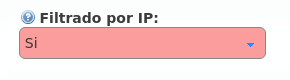

##########################
[S] Elementos de seguridad
##########################

******************
Firewall con geoIP
******************

************************************
Rangos de IP autorizados por empresa
************************************

En el proceso de creación de empresas nos saltamos deliberademente un mecanismo de seguridad que **limita las direcciones IP o rangos de red que pueden utilizar las credenciales de los terminales de una empresa concreta**.

Se puede activar en la sección **Configuración de Marca** > **Empresas**:

Todo usuario que quiera conectarse desde una red no incluida no podrá, a pesar de disponer de unas credenciales válidas.

.. error:: Una vez activado el filtrado, **es obligatorio** añadir redes o direcciones válidas o, por el contrario, todas las llamadas se rechazarán:

.. image:: img/authorized_ips.png

Se pueden añadir direcciones IP y rangos de direcciones, en formato CIDR (IP/mask):

.. image:: img/authorized_ips3.png

.. important:: Este mecanismo limita los orígenes de los usuarios de una empresa, no filtra en absoluto los orígenes de los **Contratos de Peering**.

*************
Anti-flooding
*************

IvozProvider incorpora un mecanismo de *anti-flooding* que evita que un emisor sature nuestra plataforma enviando peticiones. Ambos *proxies* (usuarios y salida) incorporan este mecanismo, que **limita el número de peticiones desde un dirección origen en un tramo concreto de tiempo**.

.. warning:: Cuando un origen llega al límite, el proxy dejará de contestarle durante un tiempo dado. Pasado ese tiempo, volverá a contestarle con normalidad.

Ciertos orígenes que están automáticamente excluidos de este mecanismo de *anti-flooding*:

- Servidores de aplicación de la plataforma.

- IPs o rangos autorizados de empresas (ver sección anterior).

El operador global puede añadir otras direcciones que queden excluidas de este mecanismo por medio del apartado **Configuración global** > **IPs de confianza**:

.. image:: img/trusted_ips.png

*******************************
Límite de llamadas concurrentes
*******************************

Otro mecanismo de seguridad que puede evitar que unas credenciales comprometidas sean utilizadas para establecer cientos de llamadas en poco tiempo, es el mecanismo que **limita el número de llamadas externas** de cada empresa.

.. note:: Este mecanismo tiene en cuenta los canales externos concurrentes, es decir, cuenta llamadas externas entrantes y llamadas externas salientes.

Se puede configurar editando una empresa y fijando el valor del siguiente campo:

.. image:: img/call_limit.png
    :align: center

.. tip:: Para desactivar este mecanismo, basta con fijar el valor a 0.

